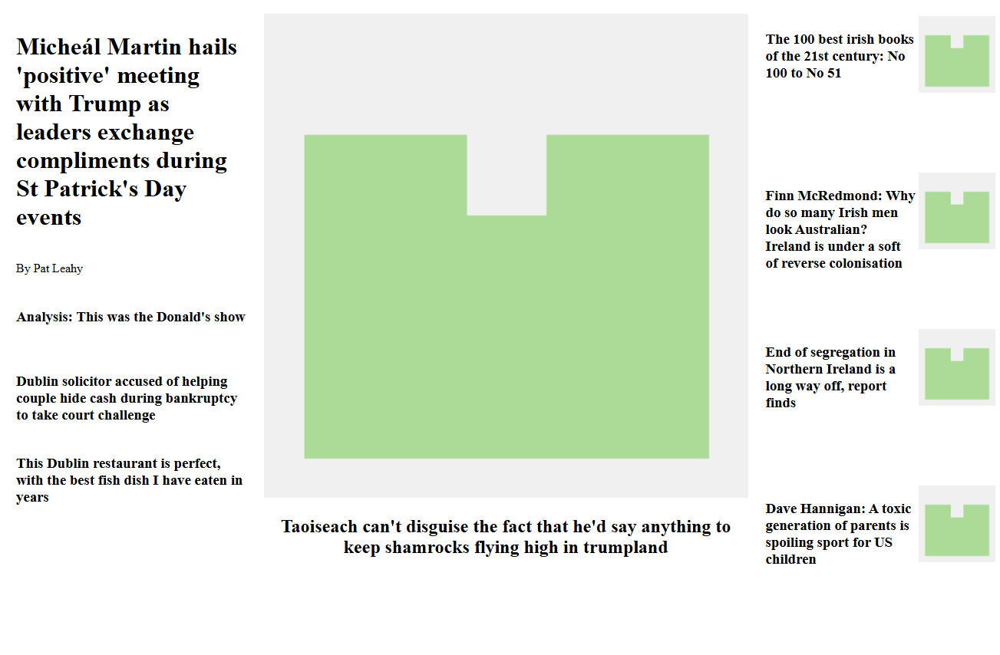

# Desafio html-table-design

---

# Sobre
   Desafios propostos em aula, desenvolver layouts utilizando apenas table do html.

---

## Tecnologias utilizadas 
  

---

# Visual final do desafio 1
  

---
# Visual final do desafio 2
  
    